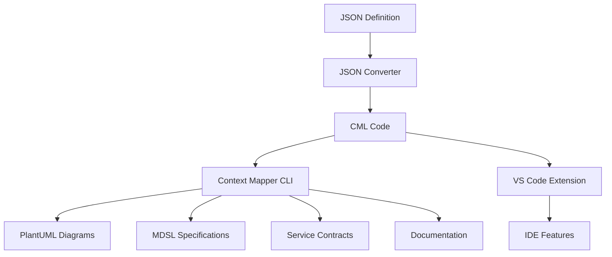
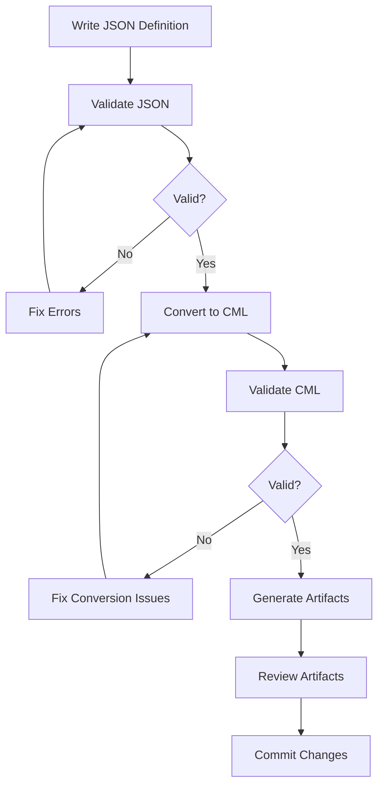

# Integration Guide

Complete guide for integrating the Context Mapper JSON Converter with the Context Mapper ecosystem and other tools.

## 📋 Table of Contents

- [Overview](#overview)
- [Context Mapper Ecosystem](#context-mapper-ecosystem)
- [Java Runtime Setup](#java-runtime-setup)
- [Context Mapper CLI Installation](#context-mapper-cli-installation)
- [Integration Configuration](#integration-configuration)
- [Artifact Generation](#artifact-generation)
- [CI/CD Integration](#cicd-integration)
- [IDE Integration](#ide-integration)
- [Workflow Integration](#workflow-integration)
- [Troubleshooting](#troubleshooting)

## 🎯 Overview

The Context Mapper JSON Converter is designed to integrate seamlessly with the broader Context Mapper ecosystem, enabling teams to leverage the full power of Context Mapper tooling while working with JSON-based definitions.

### Integration Benefits

- **Authoritative Validation**: Use official Context Mapper validation
- **Artifact Generation**: Generate PlantUML diagrams, MDSL specifications, and more
- **Tool Ecosystem**: Access to the complete Context Mapper toolchain
- **Future Compatibility**: Automatic support for new Context Mapper features
- **Quality Assurance**: Leverage battle-tested Context Mapper validation rules

### Integration Architecture

```
JSON Definition
      ↓
JSON Converter ←→ Context Mapper CLI
      ↓                    ↓
  CML Code            Artifacts
      ↓                    ↓
Context Mapper      PlantUML, MDSL,
   Ecosystem        Documentation
```

## 🏗️ Context Mapper Ecosystem

### Core Components

#### Context Mapper DSL
- **Purpose**: Domain-specific language for DDD modeling
- **Features**: Strategic and tactical DDD patterns
- **Integration**: Direct CML generation from JSON

#### Context Mapper CLI
- **Purpose**: Command-line tools for CML processing
- **Features**: Validation, transformation, artifact generation
- **Integration**: Validation and artifact generation backend

#### Context Mapper VS Code Extension
- **Purpose**: IDE support for CML development
- **Features**: Syntax highlighting, validation, refactoring
- **Integration**: Can work with generated CML files

#### Context Mapper Generator Framework
- **Purpose**: Extensible artifact generation
- **Features**: PlantUML, MDSL, Service Contracts, Documentation
- **Integration**: Artifact generation from converted CML

### Ecosystem Integration Flow



## ☕ Java Runtime Setup

Context Mapper tools require Java Runtime Environment (JRE) 11 or higher.

### Installation Options

#### Option 1: OpenJDK (Recommended)

**macOS (Homebrew):**
```bash
# Install OpenJDK 11
brew install openjdk@11

# Set JAVA_HOME
echo 'export JAVA_HOME="/opt/homebrew/opt/openjdk@11"' >> ~/.zshrc
echo 'export PATH="$JAVA_HOME/bin:$PATH"' >> ~/.zshrc
source ~/.zshrc
```

**Ubuntu/Debian:**
```bash
# Install OpenJDK 11
sudo apt update
sudo apt install openjdk-11-jdk

# Set JAVA_HOME
echo 'export JAVA_HOME="/usr/lib/jvm/java-11-openjdk-amd64"' >> ~/.bashrc
source ~/.bashrc
```

**Windows:**
```powershell
# Download and install OpenJDK from https://adoptium.net/
# Set JAVA_HOME environment variable
setx JAVA_HOME "C:\Program Files\Eclipse Adoptium\jdk-11.0.x.x-hotspot"
```

#### Option 2: Oracle JDK

Download from [Oracle JDK Downloads](https://www.oracle.com/java/technologies/downloads/) and follow installation instructions.

#### Option 3: Amazon Corretto

```bash
# macOS
brew install --cask corretto11

# Ubuntu
wget -O- https://apt.corretto.aws/corretto.key | sudo apt-key add -
sudo add-apt-repository 'deb https://apt.corretto.aws stable main'
sudo apt-get update
sudo apt-get install -y java-11-amazon-corretto-jdk
```

### Verification

```bash
# Check Java installation
java -version
javac -version

# Check JAVA_HOME
echo $JAVA_HOME

# Verify with converter
cml-convert integration-status --check-java
```

## 🔧 Context Mapper CLI Installation

### Installation Methods

#### Option 1: Download from GitHub Releases

```bash
# Download latest release
wget https://github.com/ContextMapper/context-mapper-cli/releases/latest/download/context-mapper-cli.jar

# Create executable script
cat > /usr/local/bin/context-mapper-cli << 'EOF'
#!/bin/bash
java -jar /path/to/context-mapper-cli.jar "$@"
EOF

chmod +x /usr/local/bin/context-mapper-cli
```

#### Option 2: Build from Source

```bash
# Clone repository
git clone https://github.com/ContextMapper/context-mapper-cli.git
cd context-mapper-cli

# Build with Gradle
./gradlew build

# The JAR will be in build/libs/
```

#### Option 3: Docker Container

```bash
# Pull Context Mapper Docker image
docker pull contextmapper/context-mapper-cli

# Create alias for easy usage
alias context-mapper-cli='docker run --rm -v $(pwd):/workspace contextmapper/context-mapper-cli'
```

### Configuration

Create a configuration file for the CLI:

```bash
# Create config directory
mkdir -p ~/.context-mapper

# Create configuration file
cat > ~/.context-mapper/config.properties << 'EOF'
# Context Mapper CLI Configuration
output.directory=./generated
plantuml.format=PNG
mdsl.format=YAML
validation.strict=true
EOF
```

### Verification

```bash
# Test CLI installation
context-mapper-cli --version

# Test with converter
cml-convert integration-status --check-cli
```

## ⚙️ Integration Configuration

### Converter Configuration

Configure the JSON converter to use Context Mapper integration:

#### Configuration File (`.cml-convert.json`)

```json
{
  "integration": {
    "contextMapperCliPath": "/usr/local/bin/context-mapper-cli",
    "javaHome": "/usr/lib/jvm/java-11-openjdk",
    "artifactOutputDir": "./generated",
    "enableCliValidation": true,
    "enableArtifactGeneration": true,
    "cliTimeout": 300
  },
  "validation": {
    "useContextMapperCli": true,
    "enableRoundTrip": true,
    "strictMode": true
  },
  "artifacts": {
    "plantuml": {
      "enabled": true,
      "format": "PNG",
      "outputDir": "./diagrams"
    },
    "mdsl": {
      "enabled": true,
      "format": "YAML",
      "outputDir": "./specifications"
    },
    "documentation": {
      "enabled": true,
      "format": "MARKDOWN",
      "outputDir": "./docs"
    }
  }
}
```

#### Environment Variables

```bash
# Context Mapper CLI path
export CONTEXT_MAPPER_CLI_PATH="/usr/local/bin/context-mapper-cli"

# Java home
export JAVA_HOME="/usr/lib/jvm/java-11-openjdk"

# Output directories
export CML_ARTIFACT_OUTPUT_DIR="./generated"
export CML_PLANTUML_OUTPUT_DIR="./diagrams"
export CML_MDSL_OUTPUT_DIR="./specifications"
```

#### Python Configuration

```python
from src.config import Config
from src.context_mapper_integration import ContextMapperIntegration

# Configure integration
config = Config(
    use_context_mapper_cli=True,
    context_mapper_cli_path="/usr/local/bin/context-mapper-cli",
    java_home="/usr/lib/jvm/java-11-openjdk",
    artifact_output_dir="./generated"
)

# Initialize integration
integration = ContextMapperIntegration(config)

# Check status
status = integration.get_integration_status()
print(f"Integration ready: {status.is_ready}")
```

## 📊 Artifact Generation

### Supported Artifact Types

#### PlantUML Diagrams

Generate visual representations of your Context Maps and Bounded Contexts.

```bash
# Generate PlantUML diagrams
cml-convert generate system.json plantuml --output-dir ./diagrams

# Specific diagram types
cml-convert generate system.json plantuml \
  --format context-map \
  --output-dir ./diagrams/context-maps

cml-convert generate system.json plantuml \
  --format bounded-context \
  --output-dir ./diagrams/bounded-contexts
```

**Generated Files:**
- `SystemName_ContextMap.puml` - Context Map diagram
- `BoundedContextName_BoundedContext.puml` - Bounded Context diagrams
- `SystemName_ComponentDiagram.puml` - Component diagram

#### MDSL Specifications

Generate Microservice Domain Specific Language specifications.

```bash
# Generate MDSL specifications
cml-convert generate system.json mdsl --output-dir ./specifications

# With specific options
cml-convert generate system.json mdsl \
  --format yaml \
  --include-examples \
  --output-dir ./specifications
```

**Generated Files:**
- `SystemName.mdsl` - Main MDSL specification
- `BoundedContextName_API.mdsl` - API specifications
- `SystemName_DataTypes.mdsl` - Data type definitions

#### Service Contracts

Generate service interface definitions and contracts.

```bash
# Generate service contracts
cml-convert generate system.json contracts --output-dir ./contracts

# Specific contract types
cml-convert generate system.json contracts \
  --format openapi \
  --output-dir ./contracts/openapi

cml-convert generate system.json contracts \
  --format graphql \
  --output-dir ./contracts/graphql
```

#### Documentation

Generate comprehensive documentation from your models.

```bash
# Generate documentation
cml-convert generate system.json documentation --output-dir ./docs

# With custom templates
cml-convert generate system.json documentation \
  --template custom-template.md \
  --output-dir ./docs
```

### Programmatic Artifact Generation

```python
from src.context_mapper_integration import ContextMapperIntegration

integration = ContextMapperIntegration()

# Generate all artifact types
artifacts = integration.generate_all_artifacts(
    cml_code=cml_output,
    output_dir="./generated"
)

print(f"Generated {len(artifacts)} artifacts:")
for artifact in artifacts:
    print(f"  - {artifact}")

# Generate specific artifact type
plantuml_files = integration.generate_artifacts(
    cml_code=cml_output,
    artifact_type="plantuml",
    output_dir="./diagrams"
)
```

### Artifact Customization

#### PlantUML Customization

```bash
# Custom PlantUML styling
cat > plantuml-style.puml << 'EOF'
!define CONTEXT_COLOR #E1F5FE
!define AGGREGATE_COLOR #F3E5F5
!define ENTITY_COLOR #E8F5E8

skinparam backgroundColor white
skinparam componentStyle rectangle
EOF

# Use custom styling
cml-convert generate system.json plantuml \
  --style plantuml-style.puml \
  --output-dir ./diagrams
```

#### MDSL Customization

```yaml
# mdsl-config.yaml
output:
  format: yaml
  includeExamples: true
  includeDocumentation: true
generation:
  includeDataTypes: true
  includeOperations: true
  includeEndpoints: true
```

```bash
# Use custom MDSL configuration
cml-convert generate system.json mdsl \
  --config mdsl-config.yaml \
  --output-dir ./specifications
```

## 🚀 CI/CD Integration

### GitHub Actions

```yaml
# .github/workflows/context-mapper.yml
name: Context Mapper Validation and Artifact Generation

on:
  push:
    branches: [ main, develop ]
  pull_request:
    branches: [ main ]

jobs:
  validate-and-generate:
    runs-on: ubuntu-latest
    
    steps:
    - uses: actions/checkout@v3
    
    - name: Set up Python
      uses: actions/setup-python@v4
      with:
        python-version: '3.9'
    
    - name: Set up Java
      uses: actions/setup-java@v3
      with:
        distribution: 'temurin'
        java-version: '11'
    
    - name: Install dependencies
      run: |
        pip install -r requirements.txt
        pip install -e .
    
    - name: Install Context Mapper CLI
      run: |
        wget https://github.com/ContextMapper/context-mapper-cli/releases/latest/download/context-mapper-cli.jar
        sudo mv context-mapper-cli.jar /usr/local/bin/
        echo '#!/bin/bash' | sudo tee /usr/local/bin/context-mapper-cli
        echo 'java -jar /usr/local/bin/context-mapper-cli.jar "$@"' | sudo tee -a /usr/local/bin/context-mapper-cli
        sudo chmod +x /usr/local/bin/context-mapper-cli
    
    - name: Validate JSON definitions
      run: |
        for file in models/*.json; do
          echo "Validating $file"
          cml-convert validate "$file" --use-context-mapper-cli --strict-validation
        done
    
    - name: Convert to CML
      run: |
        mkdir -p generated/cml
        for file in models/*.json; do
          output="generated/cml/$(basename "$file" .json).cml"
          cml-convert convert "$file" "$output" --enable-round-trip --use-context-mapper-cli
        done
    
    - name: Generate artifacts
      run: |
        mkdir -p generated/diagrams generated/specifications generated/documentation
        for file in generated/cml/*.cml; do
          cml-convert generate "$file" plantuml --output-dir generated/diagrams
          cml-convert generate "$file" mdsl --output-dir generated/specifications
          cml-convert generate "$file" documentation --output-dir generated/documentation
        done
    
    - name: Upload artifacts
      uses: actions/upload-artifact@v3
      with:
        name: context-mapper-artifacts
        path: generated/
    
    - name: Deploy to GitHub Pages (on main branch)
      if: github.ref == 'refs/heads/main'
      uses: peaceiris/actions-gh-pages@v3
      with:
        github_token: ${{ secrets.GITHUB_TOKEN }}
        publish_dir: generated/documentation
```

### GitLab CI

```yaml
# .gitlab-ci.yml
stages:
  - validate
  - convert
  - generate
  - deploy

variables:
  JAVA_HOME: "/usr/lib/jvm/java-11-openjdk-amd64"

before_script:
  - apt-get update -qq && apt-get install -y -qq openjdk-11-jdk wget
  - pip install -r requirements.txt
  - pip install -e .
  - wget https://github.com/ContextMapper/context-mapper-cli/releases/latest/download/context-mapper-cli.jar -O /usr/local/bin/context-mapper-cli.jar
  - echo '#!/bin/bash' > /usr/local/bin/context-mapper-cli
  - echo 'java -jar /usr/local/bin/context-mapper-cli.jar "$@"' >> /usr/local/bin/context-mapper-cli
  - chmod +x /usr/local/bin/context-mapper-cli

validate:
  stage: validate
  script:
    - |
      for file in models/*.json; do
        echo "Validating $file"
        cml-convert validate "$file" --use-context-mapper-cli --strict-validation
      done

convert:
  stage: convert
  script:
    - mkdir -p generated/cml
    - |
      for file in models/*.json; do
        output="generated/cml/$(basename "$file" .json).cml"
        cml-convert convert "$file" "$output" --enable-round-trip --use-context-mapper-cli
      done
  artifacts:
    paths:
      - generated/cml/
    expire_in: 1 hour

generate:
  stage: generate
  dependencies:
    - convert
  script:
    - mkdir -p generated/diagrams generated/specifications generated/documentation
    - |
      for file in generated/cml/*.cml; do
        cml-convert generate "$file" plantuml --output-dir generated/diagrams
        cml-convert generate "$file" mdsl --output-dir generated/specifications
        cml-convert generate "$file" documentation --output-dir generated/documentation
      done
  artifacts:
    paths:
      - generated/
    expire_in: 1 week

pages:
  stage: deploy
  dependencies:
    - generate
  script:
    - mkdir public
    - cp -r generated/* public/
  artifacts:
    paths:
      - public
  only:
    - main
```

### Jenkins Pipeline

```groovy
// Jenkinsfile
pipeline {
    agent any
    
    environment {
        JAVA_HOME = '/usr/lib/jvm/java-11-openjdk-amd64'
        PATH = "${JAVA_HOME}/bin:${PATH}"
    }
    
    stages {
        stage('Setup') {
            steps {
                sh '''
                    python -m venv venv
                    . venv/bin/activate
                    pip install -r requirements.txt
                    pip install -e .
                '''
                
                sh '''
                    wget https://github.com/ContextMapper/context-mapper-cli/releases/latest/download/context-mapper-cli.jar
                    sudo mv context-mapper-cli.jar /usr/local/bin/
                    echo '#!/bin/bash' | sudo tee /usr/local/bin/context-mapper-cli
                    echo 'java -jar /usr/local/bin/context-mapper-cli.jar "$@"' | sudo tee -a /usr/local/bin/context-mapper-cli
                    sudo chmod +x /usr/local/bin/context-mapper-cli
                '''
            }
        }
        
        stage('Validate') {
            steps {
                sh '''
                    . venv/bin/activate
                    for file in models/*.json; do
                        echo "Validating $file"
                        cml-convert validate "$file" --use-context-mapper-cli --strict-validation
                    done
                '''
            }
        }
        
        stage('Convert') {
            steps {
                sh '''
                    . venv/bin/activate
                    mkdir -p generated/cml
                    for file in models/*.json; do
                        output="generated/cml/$(basename "$file" .json).cml"
                        cml-convert convert "$file" "$output" --enable-round-trip --use-context-mapper-cli
                    done
                '''
            }
        }
        
        stage('Generate Artifacts') {
            steps {
                sh '''
                    . venv/bin/activate
                    mkdir -p generated/diagrams generated/specifications generated/documentation
                    for file in generated/cml/*.cml; do
                        cml-convert generate "$file" plantuml --output-dir generated/diagrams
                        cml-convert generate "$file" mdsl --output-dir generated/specifications
                        cml-convert generate "$file" documentation --output-dir generated/documentation
                    done
                '''
            }
        }
        
        stage('Archive') {
            steps {
                archiveArtifacts artifacts: 'generated/**/*', fingerprint: true
                publishHTML([
                    allowMissing: false,
                    alwaysLinkToLastBuild: true,
                    keepAll: true,
                    reportDir: 'generated/documentation',
                    reportFiles: 'index.html',
                    reportName: 'Context Mapper Documentation'
                ])
            }
        }
    }
    
    post {
        always {
            cleanWs()
        }
    }
}
```

## 💻 IDE Integration

### VS Code Integration

#### Extension Installation

```bash
# Install Context Mapper VS Code extension
code --install-extension contextmapper.context-mapper-vscode-extension
```

#### Workspace Configuration

```json
// .vscode/settings.json
{
  "contextMapper.cml.validation.enabled": true,
  "contextMapper.cml.formatting.enabled": true,
  "contextMapper.generators.plantuml.enabled": true,
  "contextMapper.generators.mdsl.enabled": true,
  "files.associations": {
    "*.cml": "contextmapper"
  }
}
```

#### Tasks Configuration

```json
// .vscode/tasks.json
{
  "version": "2.0.0",
  "tasks": [
    {
      "label": "Convert JSON to CML",
      "type": "shell",
      "command": "cml-convert",
      "args": [
        "convert",
        "${file}",
        "${fileDirname}/${fileBasenameNoExtension}.cml",
        "--enable-round-trip",
        "--use-context-mapper-cli"
      ],
      "group": "build",
      "presentation": {
        "echo": true,
        "reveal": "always",
        "focus": false,
        "panel": "shared"
      }
    },
    {
      "label": "Validate JSON Definition",
      "type": "shell",
      "command": "cml-convert",
      "args": [
        "validate",
        "${file}",
        "--use-context-mapper-cli",
        "--detailed"
      ],
      "group": "test",
      "presentation": {
        "echo": true,
        "reveal": "always",
        "focus": false,
        "panel": "shared"
      }
    },
    {
      "label": "Generate All Artifacts",
      "type": "shell",
      "command": "cml-convert",
      "args": [
        "generate",
        "${file}",
        "all",
        "--output-dir",
        "./generated"
      ],
      "group": "build",
      "presentation": {
        "echo": true,
        "reveal": "always",
        "focus": false,
        "panel": "shared"
      }
    }
  ]
}
```

### IntelliJ IDEA Integration

#### Plugin Installation

1. Go to File → Settings → Plugins
2. Search for "Context Mapper"
3. Install the Context Mapper plugin
4. Restart IntelliJ IDEA

#### External Tools Configuration

```xml
<!-- File → Settings → Tools → External Tools -->
<tool name="Convert JSON to CML" 
      description="Convert JSON definition to CML"
      showInMainMenu="true"
      showInEditor="true"
      showInProject="true"
      showInSearchPopup="true"
      disabled="false"
      useConsole="true"
      showConsoleOnStdOut="true"
      showConsoleOnStdErr="true"
      synchronizeAfterRun="true">
  <exec>
    <option name="COMMAND" value="cml-convert" />
    <option name="PARAMETERS" value="convert &quot;$FilePath$&quot; &quot;$FileDir$/$FileNameWithoutExtension$.cml&quot; --enable-round-trip --use-context-mapper-cli" />
    <option name="WORKING_DIRECTORY" value="$ProjectFileDir$" />
  </exec>
</tool>
```

## 🔄 Workflow Integration

### Development Workflow



### Team Workflow

```bash
#!/bin/bash
# team-workflow.sh - Standardized team workflow

set -e

echo "🚀 Starting Context Mapper workflow..."

# Step 1: Validate all JSON definitions
echo "📋 Validating JSON definitions..."
for file in models/*.json; do
    echo "  Validating $(basename "$file")"
    cml-convert validate "$file" --use-context-mapper-cli --strict-validation
done

# Step 2: Convert to CML
echo "🔄 Converting to CML..."
mkdir -p generated/cml
for file in models/*.json; do
    output="generated/cml/$(basename "$file" .json).cml"
    echo "  Converting $(basename "$file") -> $(basename "$output")"
    cml-convert convert "$file" "$output" \
        --enable-round-trip \
        --use-context-mapper-cli \
        --pretty
done

# Step 3: Generate artifacts
echo "📊 Generating artifacts..."
mkdir -p generated/{diagrams,specifications,documentation}

for file in generated/cml/*.cml; do
    basename=$(basename "$file" .cml)
    echo "  Generating artifacts for $basename"
    
    # PlantUML diagrams
    cml-convert generate "$file" plantuml \
        --output-dir generated/diagrams \
        --format png
    
    # MDSL specifications
    cml-convert generate "$file" mdsl \
        --output-dir generated/specifications \
        --format yaml
    
    # Documentation
    cml-convert generate "$file" documentation \
        --output-dir generated/documentation \
        --format markdown
done

# Step 4: Quality checks
echo "✅ Running quality checks..."
echo "  CML files: $(find generated/cml -name "*.cml" | wc -l)"
echo "  Diagrams: $(find generated/diagrams -name "*.png" | wc -l)"
echo "  Specifications: $(find generated/specifications -name "*.mdsl" | wc -l)"
echo "  Documentation: $(find generated/documentation -name "*.md" | wc -l)"

echo "🎉 Workflow completed successfully!"
```

### Release Workflow

```bash
#!/bin/bash
# release-workflow.sh - Release preparation workflow

set -e

VERSION=${1:-"latest"}
echo "🚀 Preparing release $VERSION..."

# Step 1: Full validation with strict mode
echo "📋 Full validation (strict mode)..."
for file in models/*.json; do
    cml-convert validate "$file" \
        --use-context-mapper-cli \
        --strict-validation \
        --enable-round-trip \
        --fail-on-warnings
done

# Step 2: Generate release artifacts
echo "📦 Generating release artifacts..."
mkdir -p release/$VERSION/{cml,diagrams,specifications,documentation}

for file in models/*.json; do
    basename=$(basename "$file" .json)
    
    # Convert to CML
    cml-convert convert "$file" "release/$VERSION/cml/$basename.cml" \
        --enable-round-trip \
        --use-context-mapper-cli \
        --pretty
    
    # Generate all artifacts
    cml-convert generate "release/$VERSION/cml/$basename.cml" all \
        --output-dir "release/$VERSION"
done

# Step 3: Create release package
echo "📦 Creating release package..."
cd release
tar -czf "context-mapper-models-$VERSION.tar.gz" "$VERSION/"
cd ..

echo "✅ Release $VERSION ready in release/context-mapper-models-$VERSION.tar.gz"
```

## 🔧 Troubleshooting

### Common Integration Issues

#### Java Not Found

**Problem:**
```
Error: Java runtime not found
```

**Solution:**
```bash
# Check Java installation
java -version

# Install Java if missing
sudo apt install openjdk-11-jdk  # Ubuntu/Debian
brew install openjdk@11          # macOS

# Set JAVA_HOME
export JAVA_HOME="/usr/lib/jvm/java-11-openjdk-amd64"
```

#### Context Mapper CLI Not Found

**Problem:**
```
Error: Context Mapper CLI not available
```

**Solution:**
```bash
# Check CLI availability
which context-mapper-cli

# Install CLI
wget https://github.com/ContextMapper/context-mapper-cli/releases/latest/download/context-mapper-cli.jar
sudo mv context-mapper-cli.jar /usr/local/bin/
echo '#!/bin/bash' | sudo tee /usr/local/bin/context-mapper-cli
echo 'java -jar /usr/local/bin/context-mapper-cli.jar "$@"' | sudo tee -a /usr/local/bin/context-mapper-cli
sudo chmod +x /usr/local/bin/context-mapper-cli

# Test installation
context-mapper-cli --version
```

#### Permission Issues

**Problem:**
```
Error: Permission denied when generating artifacts
```

**Solution:**
```bash
# Check directory permissions
ls -la generated/

# Fix permissions
chmod -R 755 generated/
chown -R $USER:$USER generated/

# Create directories if missing
mkdir -p generated/{diagrams,specifications,documentation}
```

#### Memory Issues

**Problem:**
```
Error: OutOfMemoryError during artifact generation
```

**Solution:**
```bash
# Increase Java heap size
export JAVA_OPTS="-Xmx2g -Xms1g"

# Use memory-efficient options
cml-convert generate system.json plantuml \
    --memory-limit 1024 \
    --parallel false
```

### Integration Status Check

```bash
# Comprehensive integration status check
cml-convert integration-status --detailed

# Check specific components
cml-convert integration-status --check-java --check-cli --check-tools

# Get setup help
cml-convert integration-status --setup-help
```

### Debug Mode

```bash
# Enable debug logging
cml-convert convert system.json system.cml \
    --debug \
    --log-file integration-debug.log \
    --use-context-mapper-cli

# Check debug log
tail -f integration-debug.log
```

## 🔗 See Also

- [CLI Reference](cli-reference.md) - Command-line integration options
- [API Documentation](api-documentation.md) - Python integration API
- [Validation Guide](validation-guide.md) - Integration validation features
- [Troubleshooting](troubleshooting.md) - Common integration issues
- [Context Mapper Documentation](https://contextmapper.org/docs/) - Official Context Mapper documentation